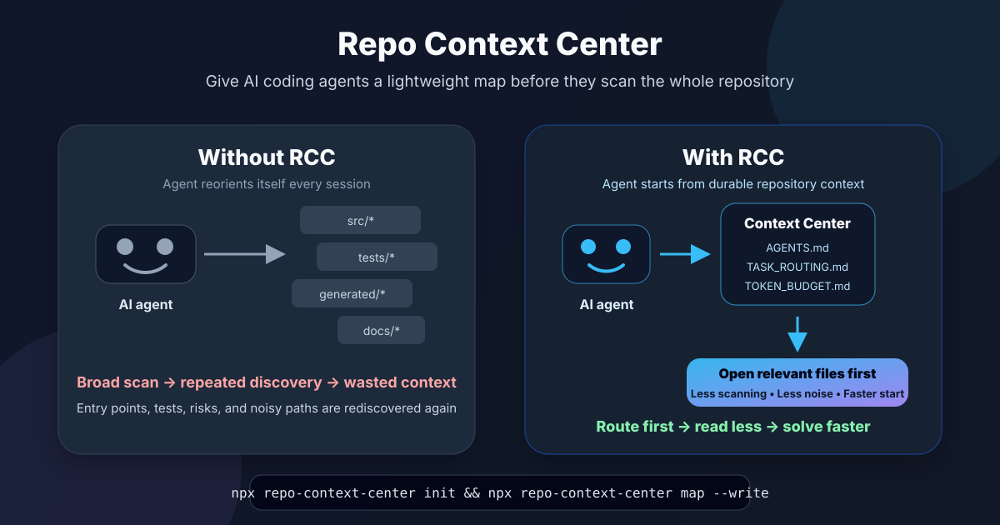

# repo-context-center


A lightweight repository memory layer for AI coding agents.

AI coding agents often waste context rediscovering the same repository structure: entrypoints, risky files, generated folders, test locations, and project docs. `repo-context-center` gives agents a compact map before they scan the repo, so they can reach relevant files faster and avoid repeating the same discovery work every session.

It works with Codex, Claude Code, Cursor, Copilot-style agents, and other coding assistants that read repository instructions or Markdown docs.

## Install

```bash
npm install -g repo-context-center
```

or

```bash
npx repo-context-center init
```

> **Local-first by design**
>
> - No API keys
> - No AI service
> - No model costs
> - Works entirely on local repository metadata

It installs and maintains small Markdown context files inside your repo.



## Proven Results

Verified on this repository:

| Scenario | Estimate |
| --- | ---: |
| Naive scan | 97,917 tokens |
| Compact startup | 546 tokens |
| Estimated saving | 99.4% |

Validated against larger public repositories with different structures:

| Repository | Files scanned | Naive scan estimate | Compact startup context | Estimated reduction |
| --- | ---: | ---: | ---: | ---: |
| FastAPI | 500 | ~936K tokens | ~862 tokens | ~99.9% |
| LangChain | 500 | ~1.18M tokens | ~4.4K tokens | ~99.6% |

Estimates use `ceil(characters / 4)` and are intended for relative comparison only. Actual tokenizer costs vary by model. No affiliation with or endorsement by FastAPI or LangChain is implied.

## Early Adoption

`repo-context-center` received 1,775+ downloads in the first 48 hours after release.

That early usage suggests developers are actively looking for lightweight ways to help AI coding agents start with better repository context.

## Why Should I Care?

AI coding agents often spend a surprising amount of context rediscovering the same repository facts:

- Which files matter for this task?
- Which generated, vendored, build, or coverage paths should be skipped?
- Where are the risky shared modules?
- Which tests are likely related?
- What did a previous session already learn?
- Which context docs should be updated after a structural change?

That repeated discovery costs tokens, time, and attention. `repo-context-center` gives agents a durable place to start, so every session can begin from the repo's current map instead of rebuilding it from scratch.

## Quick Evaluation: Try It In Under 2 Minutes

Inside any target repository:

```sh
npx repo-context-center init
npx repo-context-center map --write
npx repo-context-center estimate --compare-naive
```

This installs the context center, generates repo-specific maps, and estimates the difference between broad repo scanning and compact startup context.

> Note: `repo-context-center` writes Markdown context files into the target repository. Use `npx repo-context-center init --dry-run` if you want to preview installation first.

## How It Works

```text
Repository
  -> repo-context-center map --write
  -> AGENTS.md + docs/ai-context/*
  -> AI coding agent
  -> Relevant source files and tests
```

1. `init` installs a generic context center: `AGENTS.md` plus `docs/ai-context/*`.
2. `map --write` analyzes real files with deterministic heuristics and updates generated sections.
3. Agents read the small context layer first, then open the source files, tests, and docs most likely to matter.
4. `map --check` can fail CI when generated context becomes stale.
5. `archive` keeps long-running notes small enough to remain useful.

The generated maps are navigation aids, not a replacement for source review. Source code remains the source of truth.

## Install

Inside a target repository:

```sh
npx repo-context-center init
npx repo-context-center map --write
npx repo-context-center validate
```

Then ask your coding agent to start from the context center:

```text
Before changing code, read AGENTS.md and follow docs/ai-context/TASK_ROUTING.md.
Use the smallest relevant context set.
Check docs/ai-context/DO_NOT_READ.md before broad search.
When you learn durable repo facts, update LESSONS_LEARNED.md and CHANGE_LOG.md.
```

Preview installation without writing files:

```sh
npx repo-context-center init --dry-run
```

Overwrite existing context templates:

```sh
npx repo-context-center init --force
```

Install a PR validation workflow:

```sh
npx repo-context-center init --github-action
```

## Example

Generate repository context:

```sh
npx repo-context-center map --write
```

Example output:

```text
repo-context-center map

Files scanned: 500
Mode: write

Updated files:
- AGENTS.md (updated)
- docs/ai-context/TASK_ROUTING.md (updated)
- docs/ai-context/PROJECT_MAP.md (updated)
- docs/ai-context/HOTSPOTS.md (updated)

Detected:
- Task routing rows: 3
- Modules: 7
- Risks: 5
- Dependencies: 4
- Symbols: 6
- Hotspots: 7
```

Estimate whether the context center is reducing broad repo reads:

```sh
npx repo-context-center estimate --compare-naive
```

Example output excerpt from LangChain:

```text
Naive comparison:
- Estimated naive scan: 1,189,515 tokens
- Estimated compact startup: 4,752 tokens
- Estimated saving: 1,184,763 tokens
- Estimated saving: 99.6%
```

## Who Is This For?

`repo-context-center` is useful if you:

- use AI coding agents repeatedly in the same repository;
- maintain a medium, large, or multi-package codebase;
- want agents to avoid generated, vendored, or low-signal paths;
- need stable handoff notes across sessions;
- want CI to detect stale AI-agent navigation context;
- care about token discipline before broad source reads.

It works with JavaScript, TypeScript, Python, Go, Rust, Ruby, Java, monorepos, docs repos, and mixed stacks. Repo-specific mapping is heuristic-based and works best when files follow common conventions.

## Features

- **Repository understanding**: deterministic model of package metadata, entrypoints, key directories, tests, config, ignored areas, and noisy paths.
- **Task routing**: task-aware guidance for which context docs, source files, and tests to open first.
- **Context compression**: compact maps for modules, dependencies, symbols, risks, hotspots, token budgets, and do-not-read paths.
- **Stale context detection**: `map --check` reports when generated context no longer matches the repository.
- **Durable knowledge capture**: `LESSONS_LEARNED.md` and `CHANGE_LOG.md` store repo facts that should survive beyond one agent session.
- **Token planning**: `estimate` compares compact startup context with broad naive scans.
- **Agent entrypoint**: `AGENTS.md` gives coding agents a predictable first file to read.
- **No AI dependency**: no model calls, no API keys, no runtime AI service.

## Commands

```sh
repo-context-center --help
repo-context-center init [--dry-run] [--force] [--github-action]
repo-context-center map [--write] [--check] [--dry-run] [--json] [--max-files <number>]
repo-context-center validate [--strict]
repo-context-center archive [--keep <number>] [--dry-run]
repo-context-center estimate [--mode compact|investigation|detailed] [--task "<task>"] [--compare-naive] [--json] [--max-files <number>]
repo-context-center scan [--json]
repo-context-center suggest "<task>" [--json] [--symbols] [--max-files <number>]
```

- `init`: install the generic context templates.
- `map`: analyze repo layout and generate repo-specific context sections.
- `validate`: check that required context files exist and report warnings. Missing `.repo-context-center/config.json` is a warning by default and a failure with `--strict`.
- `archive`: archive older entries from long-running context files; defaults to keeping 50 entries.
- `estimate`: estimate task-aware source, test, and context token overhead; optionally compare with a naive repo scan.
- `scan`: inspect only the repository layout and suggest lightweight entries for context maps.
- `suggest`: recommend low-token context files, real likely files, likely tests, mode, symbols, and risk level for a task.

## Main Map Modes

Write or update generated context after meaningful repo structure changes:

```sh
npx repo-context-center map --write --max-files 300
```

Preview proposed generated context changes without writing files:

```sh
npx repo-context-center map --dry-run --max-files 300
```

Check for stale generated context in CI:

```sh
npx repo-context-center map --check --max-files 300
```

Recommended `--max-files` values:

- Small and medium repos: `150`-`300`.
- Larger repos and monorepos: `500` or more, tuned to keep CI runtime acceptable.

## Keeping Context Fresh As Your Repo Grows

> Note: `repo-context-center` does not run in the background. It updates generated context only when you run `map --write`, and it checks freshness only when you run `map --check`.

Refresh generated context after significant structure changes, such as:

- new source roots;
- renamed modules;
- new CLI entrypoints;
- changed test layout;
- updated build or config files;
- new generated-output locations;
- changed package scripts.

The generated files are meant to help AI agents navigate the repo and save tokens by skipping noisy or irrelevant paths. They are not a full dependency graph, import analyzer, or framework detector.

Use `map --check` in CI to enforce that generated context stays current. If CI fails, run:

```sh
npx repo-context-center map --write --max-files 300
```

Then commit the updated `AGENTS.md` and `docs/ai-context/*` files.

## CI Check

Use `map --check` in CI to fail pull requests when generated context files are stale:

```yaml
name: Repository Context Check

on:
  pull_request:

jobs:
  context-check:
    runs-on: ubuntu-latest
    steps:
      - name: Checkout
        uses: actions/checkout@v4

      - name: Setup Node
        uses: actions/setup-node@v4
        with:
          node-version: 20

      - name: Check generated context is fresh
        run: npx repo-context-center map --check --max-files 300
```

If CI fails, refresh the generated sections locally:

```sh
npx repo-context-center map --write --max-files 300
```

Then commit the updated `AGENTS.md` and `docs/ai-context/*` files.

> Tip: The default workflow only checks freshness. Auto-commit can be added by users, but it is not the recommended default.

See [docs/github-action.md](docs/github-action.md) for PR validation setup.

## Installed Files

`repo-context-center init` installs generic templates:

- `AGENTS.md`
- `docs/ai-context/COMMUNICATION_MODE.md`
- `docs/ai-context/TASK_ROUTING.md`
- `docs/ai-context/MODULE_INDEX.md`
- `docs/ai-context/PROJECT_MAP.md`
- `docs/ai-context/RISK_REGISTER.md`
- `docs/ai-context/DEPENDENCY_MAP.md`
- `docs/ai-context/SYMBOL_MAP.md`
- `docs/ai-context/TOKEN_BUDGET.md`
- `docs/ai-context/DO_NOT_READ.md`
- `docs/ai-context/HOTSPOTS.md`
- `docs/ai-context/LESSONS_LEARNED.md`
- `docs/ai-context/CHANGE_LOG.md`
- `docs/ai-context/archive/`

It also creates `.repo-context-center/config.json`.

`repo-context-center map --write` may update generated sections in:

- `docs/ai-context/TASK_ROUTING.md`
- `docs/ai-context/MODULE_INDEX.md`
- `docs/ai-context/PROJECT_MAP.md`
- `docs/ai-context/RISK_REGISTER.md`
- `docs/ai-context/DEPENDENCY_MAP.md`
- `docs/ai-context/SYMBOL_MAP.md`
- `docs/ai-context/HOTSPOTS.md`
- `docs/ai-context/TOKEN_BUDGET.md`
- `docs/ai-context/DO_NOT_READ.md`
- `docs/ai-context/CHANGE_LOG.md`

With `--github-action`, it also creates:

- `.github/workflows/repo-context-check.yml`

## Map Command Details

`init` creates generic templates. `map` analyzes repo layout with heuristics, and `map --write` updates generated sections between markers while preserving manual content outside those markers.

The map command:

- uses no AI and adds no runtime dependency;
- uses only real existing files;
- does not emit placeholders like `path/or/flow`;
- is best treated as a starting map, not a substitute for source review.

### Repository Understanding

The deterministic `RepositoryUnderstanding` layer behind `map` builds a compact internal model from discovered files, `package.json` when present, and existing scanner inputs before rendering context docs.

The model tracks:

- package manager and package scripts;
- real entrypoints from package metadata and conventional CLI/app files;
- key directory roles such as CLI commands, core logic, tests, docs, workflows, templates, and generated output;
- source modules, config files, real test files, and ignored areas;
- fixtures, snapshots, lockfiles, archives, generated output, and dependency folders as separate noise categories.

This improves `PROJECT_MAP.md`, `HOTSPOTS.md`, and `DEPENDENCY_MAP.md` by making entrypoints, high-impact files, key directory roles, and high-level dependency hints more consistent. It also reduces fixture and snapshot noise in routing, module, symbol, hotspot, and dependency output.

> Important: The mapper currently does not perform framework detection, import graph parsing, AI/LLM analysis, or project-pack selection.

## Recommended AI Agent Workflow

Ask the agent to:

1. Read `AGENTS.md`.
2. Follow `docs/ai-context/TASK_ROUTING.md`.
3. Check `docs/ai-context/TOKEN_BUDGET.md` and `docs/ai-context/DO_NOT_READ.md`.
4. Read only the on-demand context files relevant to the task.
5. Verify source code before changing behavior.
6. Update context files only when durable repo knowledge changes.

See [docs/agent-usage.md](docs/agent-usage.md).

## Token-Saving Strategy

The context center is meant to reduce repeated discovery, not replace source reading. It works by keeping small, stable maps near the repo:

- route tasks before opening many files;
- skip generated and vendored paths by default;
- keep module, dependency, risk, and symbol notes compact;
- archive long-running notes before they become noisy.

When to expand context:

- a caller is unclear;
- a test failure points outside the first module;
- a shared type or dependency boundary is involved;
- a risk note says the change has wider impact.

Token estimates use `ceil(characters / 4)`. They are rough planning numbers, not exact tokenizer output and not model billing estimates. Percentages are estimates and actual tokenizer usage may differ. The command is meant to help evaluate whether the context center is reducing broad repo reads enough to justify its own startup cost.

See [docs/token-strategy.md](docs/token-strategy.md).

## Example: Before/After Session Behavior

Before:

> The agent scans broadly, opens generated files, rediscovers entrypoints, misses a risky shared module, and repeats the same investigation next session.

After:

> The agent reads `AGENTS.md`, follows task routing, opens the relevant module map, checks hotspots, edits a smaller set of files, runs focused tests, and records durable lessons.

More examples are in [docs/examples.md](docs/examples.md).

## Why I Built This

While working with AI coding agents, I noticed that a large portion of context was repeatedly spent rediscovering repository structure.

The same files were reopened, the same entrypoints were rediscovered, and the same repository questions were answered over and over again.

Repo Context Center was created to provide a durable repository memory layer that helps agents navigate before they start coding.

## Current Capabilities

| Capability | Status |
| --- | --- |
| Generic context installation | Available |
| Repository understanding | Available |
| Task routing | Available |
| Context compression | Available |
| Token estimation | Available |
| Suggested files for a task | Available |
| Stale context detection | Available |
| CI freshness check | Available |
| Durable knowledge notes | Available |
| Context archiving | Available |

## Future Roadmap

| Capability | Status |
| --- | --- |
| Richer import graph | Planned |
| Better framework detection | Planned |
| Safer merge/update UX | Planned |
| Project-specific packs | Planned |
| Context analytics | Planned |
| Token analytics | Planned |
| Agent handover improvements | Planned |

## Further Reading

- [Concept](docs/concept.md)
- [Agent usage](docs/agent-usage.md)
- [Token strategy](docs/token-strategy.md)
- [Examples](docs/examples.md)
- [GitHub Action](docs/github-action.md)

## Development

```sh
npm install
npm run build
npm test
```

## Manual Release

This package is prepared for manual npm publishing.

```sh
npm run build
npm test
npm pack
```

The package publishes the compiled `dist/` output, including the generic context templates copied during build. `prepublishOnly` runs build and tests before a manual `npm publish`.
